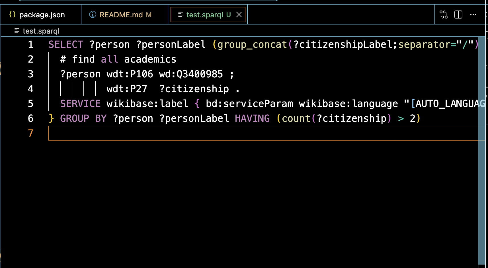
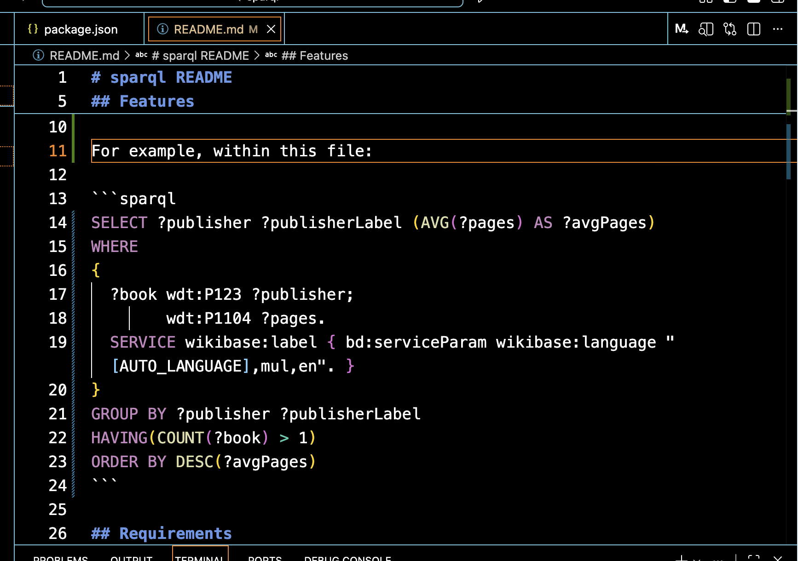

# sparql README

Grammar obtained from <https://github.com/shikijs/shiki/pull/147/files>.

## Features

Adds syntax highlighting for `.sparql` files:



Adds syntax highlighting for SPARQL within Markdown files:



For example, within this file:

```sparql
SELECT ?publisher ?publisherLabel (AVG(?pages) AS ?avgPages)
WHERE
{
  ?book wdt:P123 ?publisher;
        wdt:P1104 ?pages.
  SERVICE wikibase:label { bd:serviceParam wikibase:language "[AUTO_LANGUAGE],mul,en". }
}
GROUP BY ?publisher ?publisherLabel
HAVING(COUNT(?book) > 1)
ORDER BY DESC(?avgPages)
```

## Release Notes

- See [CHANGELOG.md](./CHANGELOG.md)
